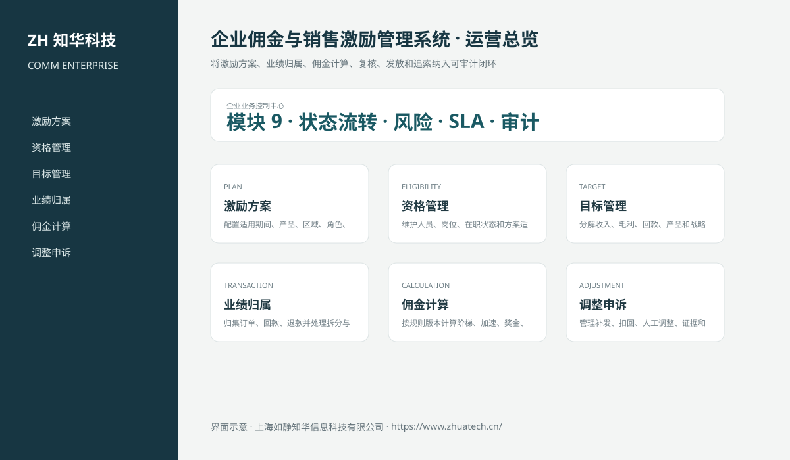

# ZhuaTech COMM｜企业佣金与销售激励管理系统

> 将激励方案、业绩归属、佣金计算、复核、发放和追索纳入可审计闭环

ZhuaTech COMM 是知华科技（上海如静知华信息科技有限公司）发布的企业级源码项目，面向“激励方案、适用资格、目标、交易归属、佣金计算、调整、审批、发放与追索”提供管理端与响应式业务端。工程采用前后端分离架构，所有示例数据均为虚构数据。

[知华科技官网](https://www.zhuatech.cn/) · [架构说明](docs/ARCHITECTURE.md) · [API 文档](docs/API.md) · [企业能力](docs/ENTERPRISE.md) · [测试说明](docs/TESTING.md)



## 业务模块

| 模块 | 核心能力 |
| --- | --- |
| 激励方案 | 配置适用期间、产品、区域、角色、阶梯和封顶规则 |
| 资格管理 | 维护人员、岗位、在职状态和方案适用资格 |
| 目标管理 | 分解收入、毛利、回款、产品和战略目标 |
| 业绩归属 | 归集订单、回款、退款并处理拆分与归属争议 |
| 佣金计算 | 按规则版本计算阶梯、加速、奖金、封顶和扣减 |
| 调整申诉 | 管理补发、扣回、人工调整、证据和申诉 |
| 结果复核 | 执行经理、财务、人力和合规多级复核 |
| 发放管理 | 生成发放批次并对接薪资、应付或渠道结算 |
| 追索审计 | 对退单、坏账和违规交易执行追索并保留证据 |


## 企业级控制

- ADMIN / OPERATOR 角色边界和管理员接口隔离；
- 服务端字段、模块、唯一编号和状态迁移校验；
- 组织、期间、责任人、风险等级、到期日和 SLA 统计；
- 支持组织/账期隔离查询、治理驾驶舱、办结率、证据缺口与同步失败监控；
- 支持最多 100 条控制项的原子批量提交、管理员批量复核和失败整体回滚；
- 支持组织账期锁定/解锁，锁定后禁止新增、提交、审批、补证和办结；
- 幂等创建、JPA 乐观锁、重复提交保护和职责分离；
- 附件 SHA-256 元数据、业务凭证完整性与全流程审计；
- 组合检索、分页、逾期筛选、UTF-8 CSV 导出和协作时间线；
- 外部系统仅预留适配器，使用方自行配置地址与凭据；
- prod profile 拒绝默认密码、弱数据库口令和本地跨域来源。

## 技术架构

- 后端：Java 21、Spring Boot、Spring Security、JPA、Bean Validation、Actuator
- 前端：Vue 3、Vite、Axios，支持桌面端与移动端响应式布局
- 数据库：MySQL 8；自动化测试使用 H2
- 交付：Docker Compose、Nginx、环境变量、GitHub Actions
- Java 包名：`cn.zhuatech.commission`

## 启动与测试

```bash
cd backend && mvn test
cd ../frontend && npm install && npm run build
cd .. && cp .env.example .env && docker compose up --build
```

开发演示账号：`admin / admin123`、`operator / operator123`。生产环境必须通过环境变量替换全部默认凭据。

## 许可与商业授权

Copyright © 2026 上海如静知华信息科技有限公司。

本工程仅允许个人学习、研究和非商业技术交流，**不得用于商业用途**。企业内部使用、生产部署、SaaS运营、项目交付、品牌替换、收费培训、咨询实施或再分发，均须事先获得上海如静知华信息科技有限公司书面授权，详见 [LICENSE](LICENSE)。

深度开发、私有化部署、系统集成与企业数字化咨询，请访问[知华科技官网](https://www.zhuatech.cn/)或扫码联系：

| 微信咨询一 | 微信咨询二 |
| --- | --- |
|  |  |

SEO：企业佣金与销售激励管理系统、COMM系统源码、企业数字化、Java企业系统、Vue管理系统、知华科技、上海如静知华信息科技有限公司。
